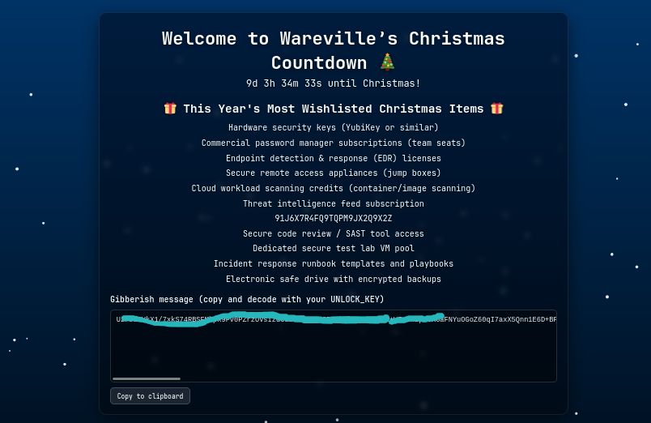

# SideQuest 1 🎯 

For those who consider themselves intermediate and want another challenge, check McSkidy's hidden note in ```/home/mcskidy/Documents/``` to get access to the key for Side Quest 1! Accessible through our Side Quest Hub!

I navigated to:

```
cd /home/mcskidy/Documents/
ls
cat read-me-please.txt
```


I found a username, a password, and three mysterious clues pointing to tiny “easter eggs.”

Follow every clue that is given.

After logging in using the credentials **eddi_knaap**, *“I ride with your session, not with your chest of files. Open the little bag your shell carries when you arrive.”* means the shell startup files, such as ```.bashrc*``` or ```.profile```.

```
ls -la
cat .bashrc
```

Scrolling to the bottom… and there it was.


```
export PASSFRAG1="[REDACTED]"

```

clue 2, **“The tree shows today; the rings remember yesterday. Read the ledger’s older pages.”**, There is a ```.secret_git``` directory, and there is also a ```.git``` directory.

Running:

```git log ```

This shows the commit history. To see actual file contents from a commit:

``` git show <commitID>```


```
+PASSFRAG2: [REDACTED]
```
Clue number three, **“When pixels sleep, their tails sometimes whisper plain words. Listen to the tail.”**, refers to an image file.

```
ls -la ~/Pictures
```
Searching for hidden files.
and You’ll see a hidden .easter_egg picture.

```
cat cat ~/Pictures/.easter_egg 
```
And at the very bottom.

```
~~ HAPPY EASTER ~~~
PASSFRAG3: [REDACTED]

```

# Combining the three flags 🏳️ 

Combining the three flags into one to produce the passphrase required to decrypt one of the encrypted files on the machine.

```
find ~ -name "*.gpg"
```
output: 

```
/home/eddi_knapp/.secret/dir.tar.gz.gpg
/home/eddi_knapp/Documents/mcskidy_note.txt.gpg
```

 #### Decrypting the GPG File
 

```
gpg --batch --yes --passphrase "<flags>" /home/eddi_knapp/Documents/mcskidy_note.txt.gpg
cat /home/eddi_knapp/Documents/mcskidy_note.txt
```

The note says to edit ```/home/socmas/2025/wishlist.txt```  with UNLOCK_KEY: [REDACTED], replace the contents with the new text, and save it.

```
Hardware security keys (YubiKey or similar)
Commercial password manager subscriptions (team seats)
Endpoint detection & response (EDR) licenses
Secure remote access appliances (jump boxes)
Cloud workload scanning credits (container/image scanning)
Threat intelligence feed subscription
[UNLOCK_KEY]
Secure code review / SAST tool access
Dedicated secure test lab VM pool
Incident response runbook templates and playbooks
Electronic safe drive with encrypted backups
```
The website will show ciphertext, copy the Gibberish message text.



save that ciphertext into a file ```website_output.txt```
Decode it using the UNLOCK_KEY

```
openssl enc -d -aes-256-cbc -pbkdf2 -iter 200000 -salt -base64 \
-in website_output.txt \
-out decoded_message.txt \
-pass pass:'[UNLOCK_KEY]'

```
Read the final message:

```
Well done — the glitch is fixed. Amazing job going the extra mile and saving the site. Take this flag THM{REDACTED}

NEXT STEP:
If you fancy something a little...spicier....use the FLAG you just obtained as the passphrase to unlock:
/home/eddi_knapp/.secret/dir

That hidden directory has been archived and encrypted with the FLAG.
Inside it you'll find the sidequest key.
```

Decrypt the Sidequest

```
cd ~/.secret

gpg --batch --yes --passphrase '[flag]' \
-o dir.tar.gz -d dir.tar.gz.gpg

# Now extract it:
tar -xzf dir.tar.gz
ls dir

```
the picture will be like this


