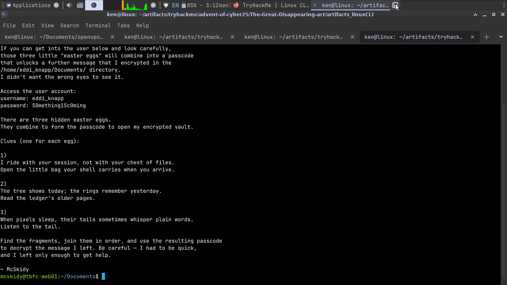
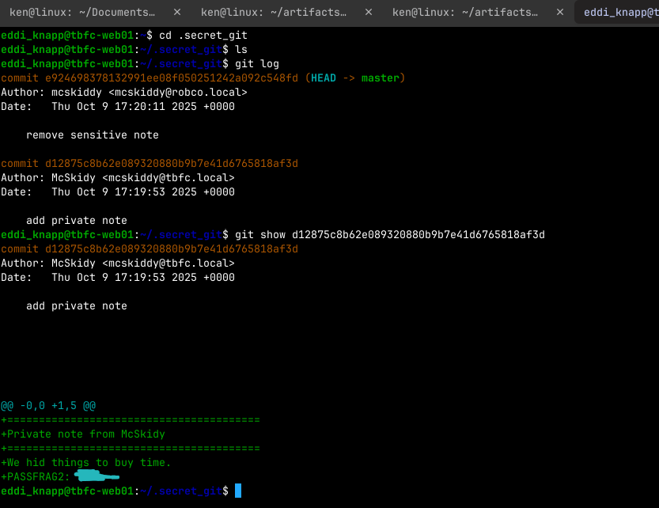

#Part 2: SideQuest 1 🎯 

For those who consider themselves intermediate and want another challenge, check McSkidy's hidden note in ```/home/mcskidy/Documents/``` to get access to the key for Side Quest 1! Accessible through our Side Quest Hub!

I navigated to:

```
cd /home/mcskidy/Documents/
ls
cat read-me-please.txt
```


I found a username, a password, and three mysterious clues pointing to tiny “easter eggs.”

Follow every clue that is given.

After logging in using the credentials **eddi_knaap**, *“I ride with your session, not with your chest of files. Open the little bag your shell carries when you arrive.”* means the shell startup files, such as ```.bashrc*``` or ```.profile```.

```
ls -la
cat .bashrc
```

Scrolling to the bottom… and there it was.


```
export PASSFRAG1="[REDACTED]"

```

clue 2, **“The tree shows today; the rings remember yesterday. Read the ledger’s older pages.”**, There is a ```.secret_git``` directory, and there is also a ```.git``` directory.

Running:

```git log ```

This shows the commit history. To see actual file contents from a commit:

``` git show <commitID>```




